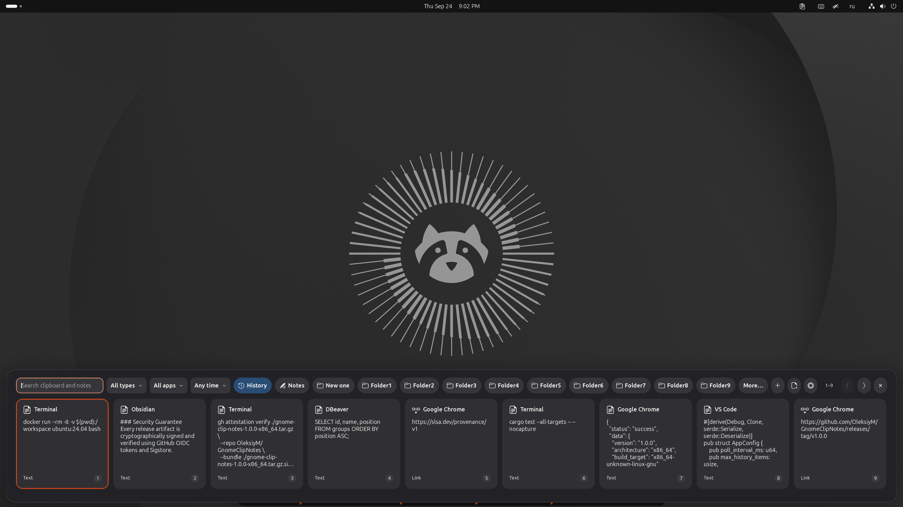
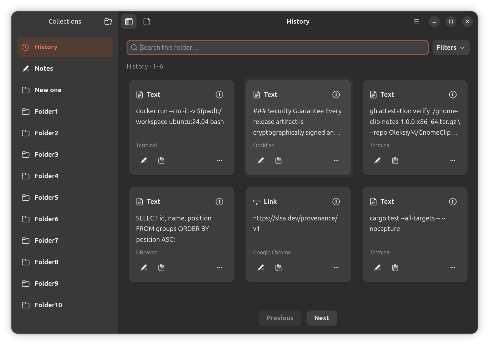
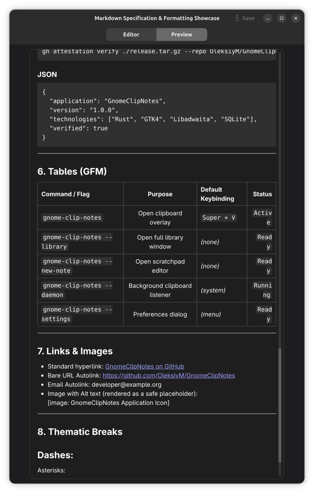

# GnomeClipNotes

A native clipboard history and Markdown notes app for GNOME on Wayland.
Find copied text without leaving your work, keep useful fragments as notes,
and export them as readable Markdown.

[](site/assets/overlay-dark.png)

*Overlay — search, filter and paste without leaving the current app.*

<table>
<tr>
<td width="55%" valign="top">
<a href="site/assets/library-dark.png"></a>
<p><em>Library — turn clipboard history into persistent notes and folders.</em></p>
</td>
<td width="45%" valign="top">
<a href="site/assets/full-preview.png"></a>
<p><em>Full preview — richer Markdown when you need it.</em></p>
</td>
</tr>
</table>

**Clipboard overlay in GNOME Shell, native Library, and Markdown editing — one continuous workflow.**

[Explore the gallery](https://oleksiym.github.io/GnomeClipNotes/#screenshots)

## Keep what matters

**Capture → Curate → Organize → Export → Develop → Reuse.**

- **Capture and find:** press **Super+V** for the overlay. Search and filter by
  type, source app or date; move between cards with arrows and paste with **Enter**.
- **Keep deliberately:** move fragments into Notes or custom folders. History can
  expire automatically; saved collections stay until you remove them.
- **Edit and read:** open the Library with **Super+B**. Use **F4** to edit a
  selected card or **F3** to view it. Choose rich **Full · WebKit** preview or
  lightweight **Native** preview in Settings.
- **Take it further:** export Notes and folders as separate Markdown files.
  Continue developing and reusing your material in your preferred tools.

Plain text and Markdown, stored locally. No account, cloud storage or
synchronization service. Images, files and HTML capture are outside the current
scope. Settings → Shortcuts lists the available bindings and alternatives.

Since 1.1.0, the applications-menu launcher opens Library directly.
Super+V and the panel indicator keep opening the overlay.

## Install

Two installation paths, **the same complete app**. Both verify SHA256 and can
check signed provenance. Use GNOME on Wayland with compatible runtime libraries.

### Standard install — recommended

For users who manage dependencies themselves. Short standalone shell scripts;
no Python, automatic package installation or rollback. **Install dependencies,
save/close editors, disable the extension and quit the app first.** Closing Library
does not stop the service. See the [preparation commands](docs/installation.md#standard-installation-and-updates).

```sh
curl -fsSL https://raw.githubusercontent.com/OleksiyM/GnomeClipNotes/main/install.sh | bash
```

Standard reports skipped provenance when gh is missing or too old;
`--require-provenance` makes it mandatory. A failed verification stops installation.
Uninstall, keeping notes and settings:

```sh
curl -fsSL https://raw.githubusercontent.com/OleksiyM/GnomeClipNotes/main/uninstall.sh | bash
```

### Guided install — help with setup and updates

For users who want a dependency offer, coordinated service shutdown and recovery
of previous program files. Requires Python 3 and a listed platform. Save/close
editors first; installed but incompatible gh must be upgraded or Standard used instead.

```sh
curl -fsSL https://raw.githubusercontent.com/OleksiyM/GnomeClipNotes/main/guided-install.sh | bash
```

Guided uninstall: `python3 "$HOME/Applications/GnomeClipNotes/install-release.py" --uninstall`.
Use the same method for updates; uninstall the previous method without purging data
before switching. [Requirements and method comparison](docs/installation.md).

Prefer doing it yourself? Follow the
[manual archive installation and runtime requirements](docs/installation.md#manual-installation-from-an-archive).
No Rust toolchain is needed for a prebuilt archive.

After installation, log out and back in, then enable GnomeClipNotes in Extensions.
The app and matching Shell extension are both needed for clipboard capture.
Notes and settings are retained during managed updates.
See [installation, updates and uninstall](docs/installation.md) and
[artifact verification](docs/artifact-verification.md) for details.

The x86_64 app has been used on **Fedora 44** and **Ubuntu 26.04.1**; the screenshots
come from the latter. Standard's file install/uninstall cycle was also checked on
the Fedora desktop; Ubuntu retesting remains pending. Archives are
built on Fedora 44, not universal across older distributions. Starting with 1.1.0,
the release workflow targets x86_64 and ARM64; ARM desktop support is experimental.

[Download releases](https://github.com/OleksiyM/GnomeClipNotes/releases) ·
[Website](https://oleksiym.github.io/GnomeClipNotes/)

## Learn more

- [Interface and shortcuts](docs/interface.md) — overlay, Library, selection and editors.
- [Markdown preview](docs/preview.md) — Full versus Native and their limits.
- [Export](docs/export.md) — readable collections and optional, confirmed cleanup.
- [Privacy and limitations](docs/privacy.md) — local storage and capture exclusions.
- [Translations](docs/translations.md) — English in 1.0; adding languages and changing messages.
- [Architecture](docs/architecture.md) and [project map](AGENTS.md) — where things live and why.
- [Documentation index](docs/README.md) · [Changelog](CHANGELOG.md).

**About → Check for Updates** checks for a new release only when requested.
There is no background updater. Export is not a database backup: use
`gnome-clip-notes --backup PATH` for a consistent SQLite snapshot.

## Build from source

The core uses Rust, GTK4/libadwaita and SQLite; the GNOME Shell extension owns
Wayland clipboard and desktop integration. Full preview uses a separate WebKitGTK
editor process.

Install a recent stable Rust toolchain with [rustup](https://rustup.rs/).
Native minimums are GTK 4.12 and libadwaita 1.5; libsoup 3, WebKitGTK 6.0
development files and gettext are also required.

Fedora:

```sh
sudo dnf install gtk4-devel libadwaita-devel libsoup3-devel webkitgtk6.0-devel gettext desktop-file-utils
cargo build --release --locked
```

Ubuntu source-build dependencies:

```sh
sudo apt install libgtk-4-dev libadwaita-1-dev libsoup-3.0-dev libwebkitgtk-6.0-dev gettext desktop-file-utils
cargo build --release --locked
```

For a trusted source checkout on the supported packaging target,
`bash scripts/install.sh` builds the package and runs its installer.
See [distribution](docs/distribution.md) and [manual testing](docs/manual-testing.md);
successful compilation alone does not establish desktop compatibility.

## Development and releases

Small reviewed changes may go directly to `main`, with CI checks; branches are
optional. Use meaningful commit subjects for generated release notes.
Public releases start at 1.0.0: fixes normally increment patch, features minor.
An approved version tag runs checks, builds and attests the archive, publishes
the Release, and deploys the website. Main pushes do not publish.
See the [release path](AGENTS.md#release-path) and [website instructions](site/README.md).

The public checkout is self-contained. Optional maintainer context lives in
ignored `.private/`; it is not required to build, test or contribute, and must
not enter public commits or website assets.

## License

MIT. See [LICENSE](LICENSE).
